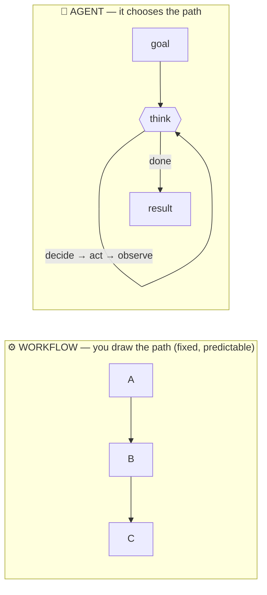
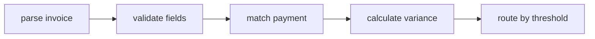
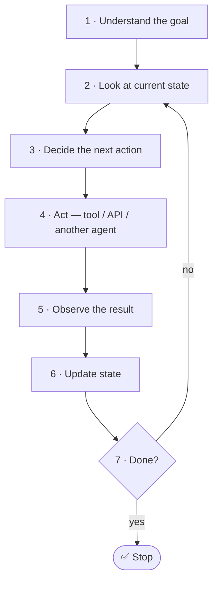
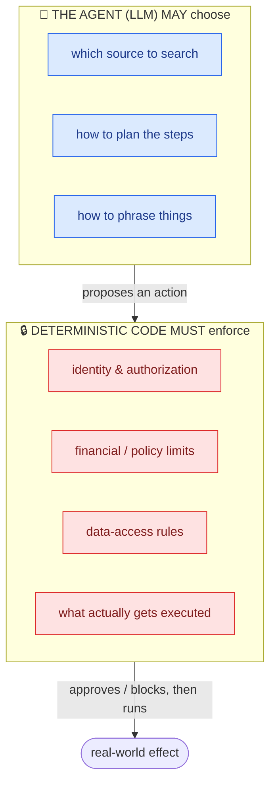
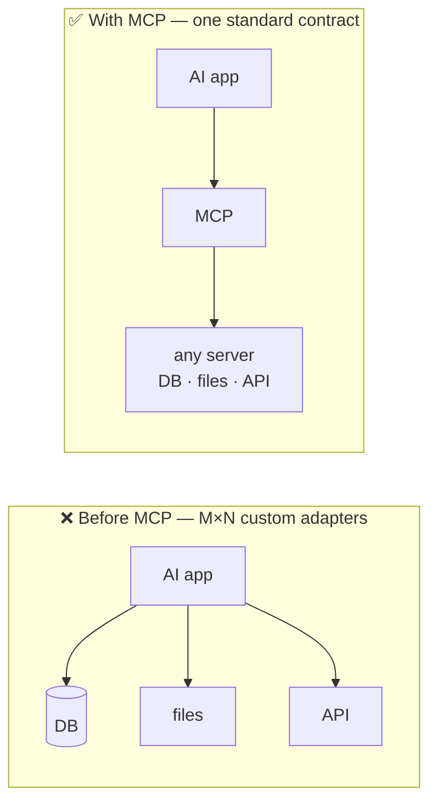
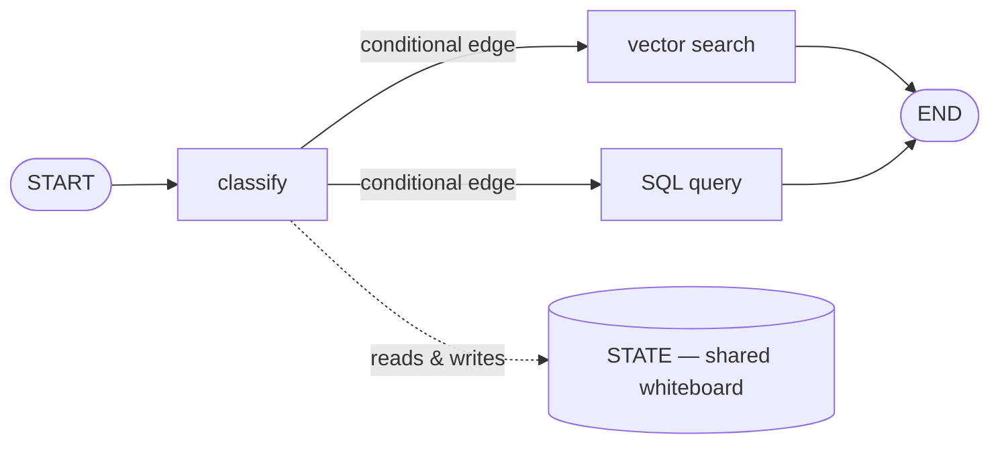
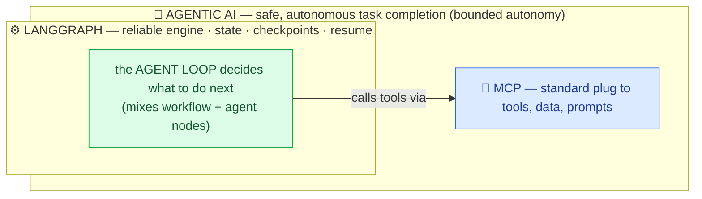

## The one-sentence mental model

Read this first. Everything below is an expansion of it.

> **A workflow follows a path you drew. An agent decides the path itself. Agentic AI is a system that lets an agent pursue a goal safely, step by step. MCP is how that agent plugs into tools. LangGraph is the engine that runs the whole thing reliably.**

Or as a picture:

---

## 1. What is a Workflow?

**Plain definition:** A workflow is a set of steps a developer defines *in advance*. Same kind of input → same path, every time.

**Analogy:** A **train on tracks**. It's fast, safe, and predictable — but it can only go where the rails already lead.

**How it works:** The developer specifies the sequence, the branches ("if amount > 10,000, route to manager"), the validation rules, and when it's finished. Because the path is fixed, workflows are easy to **test, audit, and operate**.

**Example — Invoice reconciliation:**

Every invoice flows through the same steps.

**When to use it:** Stable business rules, compliance checkpoints, anything where you need *exact repeatability* and the path is already known.

> 💡 **Key point:** A workflow is *not less advanced* than an agent. For predictable, high-risk, or auditable processes, a workflow is often the *safer and better* choice.

---

## 2. What is an AI Agent?

**Plain definition:** An agent is an AI system that **decides its own next action** based on the situation, takes that action (using tools), sees the result, and adapts — repeating until the goal is met.

**Analogy:** A **self-driving car** instead of a train. No fixed rails — it senses the road and chooses turns to reach the destination.

**The critical formula:**

> **Agent = Model + Instructions + Tools + State + Runtime Controls**

An agent is **not just "an LLM with tools."** The LLM only *proposes* what to do. The surrounding software (the "harness") validates the request, checks permissions, remembers progress, retries failures, and stops runaway loops.

**The agent loop** — the heartbeat of every agent:

**Chatbot vs. Agent — the clearest contrast:**

| | Chatbot | Agent |
|---|---|---|
| **Optimized for** | Conversation & answers | Completing tasks & taking action |
| **Output** | Text reply | Reply **plus** actions/artifacts |
| **Execution** | One response, turn ends | Multi-step, adaptive loop |
| **Example** | *Explains* how a refund works | *Retrieves the order, checks eligibility, gets approval, issues the refund, logs the audit trail* |

---

## 3. What is Agentic AI?

**Plain definition:** Agentic AI is the whole discipline (and system) of building AI that can **pursue a goal through multiple steps under safe, bounded controls** — deciding, acting, observing, and adapting.

**The word that matters most: _bounded_.** Production agents don't get *unlimited* freedom. They get **bounded autonomy** — freedom to choose *among approved options*, while deterministic software enforces the guardrails.

**Analogy:** A **new employee with a company credit card**. They can make decisions and get work done — but there are spending limits, approval steps for big purchases, and an audit trail. That balance of freedom + controls *is* agentic AI.

**The "autonomy boundary" — the single most important design idea:**

**The golden rule:**

> **Use the LLM for judgement where things are ambiguous. Use plain, deterministic software for identity, authorization, exact calculations, side effects, policy, and safety.**

> 💡 **The best real-world systems are hybrid:** deterministic code handles the rules and safety, while the agent handles the ambiguous parts (routing, planning, synthesis). *(For a when-to-use-which cheat-sheet mapped to each demo, see the decision tables further down this page.)*

---

## 4. What is MCP (Model Context Protocol)?

**Plain definition:** MCP is an **open, standard "plug" that lets an AI application connect to external tools, data, and reusable prompts** — without writing custom glue code for every single system.

**Analogy:** MCP is the **USB-C of AI tools.** Before USB-C, every device needed its own cable. Before MCP, every AI app needed a custom adapter for each database, file store, or API. MCP is one standard connector everything can speak.

**The problem it solves:**

**The three things an MCP server can offer:**

| Component | What it is | Example |
|---|---|---|
| **Tools** | Actions the model can invoke | `create_correction_request` |
| **Resources** | Addressable data to read | `billing://schema/invoices` |
| **Prompts** | Reusable prompt templates | `review_invoice_discrepancy` |

**The cast of characters:**
- **Host** — the AI application (e.g., an enterprise chat assistant)
- **Client** — the connection manager (usually one per server)
- **Server** — publishes the capabilities (wraps a database, an API, etc.)

**Two things people get wrong — clear these up:**
- ❌ *"MCP is an agent framework / it makes the plan."* — **No.** MCP only handles **connection & discovery**. It does *not* decide the agent's plan or enforce your business policy.
- ❌ *"If a tool is advertised over MCP, it's safe to use."* — **No.** MCP does **not** make a tool secure. You still need authentication, authorization, input validation, rate limits, and audit logging on top.

> 💡 MCP doesn't replace REST — it often **wraps** existing REST APIs and exposes them in an AI-friendly, discoverable form. *(Demo 4 · MCP shows this running inside an agent.)*

---

## 5. What is LangGraph?

**Plain definition:** LangGraph is a **low-level orchestration engine** for running stateful, long-running agent workflows reliably — with memory, branching, pausing, and crash recovery built in.

**Analogy:** If the agent is the "brain," LangGraph is the **nervous system and skeleton** — it carries information around, remembers where you are, and keeps everything standing up even when something fails.

**The four building blocks (learn these and LangGraph clicks):**

| Block | What it does | Analogy |
|---|---|---|
| **State** | Shared, typed data carried through the whole run | The shared whiteboard everyone reads/writes |
| **Nodes** | Do one unit of work; return only what they change | Workers at stations |
| **Edges** | Fixed transitions between nodes | Roads |
| **Conditional edges** | Choose the *next* node dynamically | A traffic cop deciding which road |
| **Reducers** | Rules for *merging* updates when two nodes write the same field | How to combine two people's edits without one erasing the other |

**Why teams reach for LangGraph — its superpowers:**

- **Durable execution & checkpointing** — it saves a snapshot at each step. If the server crashes after 20 minutes of work, it **resumes from the checkpoint** instead of starting over.
- **Human-in-the-loop (interrupts)** — it can **pause** for days waiting for a human to approve an action, persist the state, then resume exactly where it left off. (Perfect for "refund of ₹75,000 needs finance approval.")
- **Loops, branching, parallel work, multi-agent coordination** — things a simple tool-calling loop can't express cleanly.

> 💡 **Rule of thumb:** Start with the *simplest* thing that works. Reach for a custom LangGraph only when you genuinely need explicit state, durability, approvals, or complex routing — **not** just to look sophisticated. *(Demo 9 · LangGraph builds one with a human-approval gate; the Frameworks table below compares it to the alternatives.)*

---

## How they all fit together

These five ideas aren't competing — they **stack**:

**A single sentence tying it together:**
> An **agentic AI** system uses **LangGraph** to reliably run an **agent** (which decides the path) alongside deterministic **workflow** steps (which enforce the rules), and connects to the outside world through **MCP** tools.

---

## 30-second recap you can quote in a meeting

| Concept | One line to remember |
|---|---|
| **Workflow** | You draw the path in advance — predictable, testable, best for stable/high-risk rules. |
| **AI Agent** | The AI draws its own path via a *decide → act → observe* loop. Agent = Model + Tools + State + Controls. |
| **Agentic AI** | Goal-seeking systems with **bounded** autonomy — LLM for judgement, code for safety. |
| **MCP** | The "USB-C for AI" — one standard way to plug agents into tools, data, and prompts (not a planner, not automatic security). |
| **LangGraph** | The reliable engine — shared state, checkpoints, pause/resume, branching — that runs agents *and* workflows together. |
